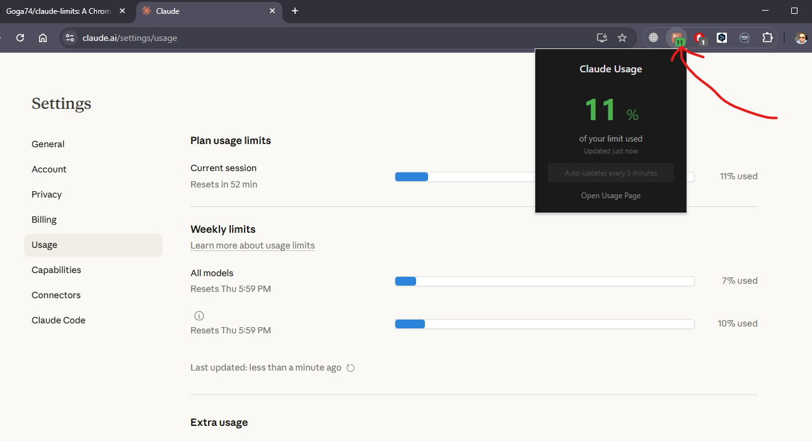

# 0Tokens - Claude Usage Monitor

A Chrome extension that displays your Claude AI usage limits directly in the browser toolbar badge.

## Features

- **Badge Display** - Shows current usage percentage right on the extension icon
- **Color-Coded Status**:
  - 🟢 Green (0-50%) - Plenty of usage remaining
  - 🟠 Orange (51-80%) - Moderate usage
  - 🔴 Red (81-100%) - High usage, approaching limit
  - ⚪ Gray "?" - Not logged in or no data
- **Manual Refresh** - Update usage data on demand
- **Background Updates** - Fetches data without interrupting your workflow
- **Persistent Storage** - Remembers last known usage between browser sessions

## Screenshots

<!-- Add screenshots here -->


## Installation

### Install as Unpacked Extension (Developer Mode)

1. Download or clone this repository
2. Open Chrome and navigate to `chrome://extensions/`
3. Enable **Developer mode** (toggle in the top right corner)
4. Click **Load unpacked**
5. Select the `claude-limits` folder
6. The extension icon will appear in your toolbar

### Pin the Extension

1. Click the puzzle piece icon in Chrome toolbar
2. Find "0Tokens" in the list
3. Click the pin icon to keep it visible

## Usage

### View Current Usage

- Look at the badge on the extension icon - it shows your current usage percentage
- Click the extension icon to open the popup with more details

### Refresh Usage Data

1. Click the extension icon to open the popup
2. Click the **Refresh** button
3. The extension will:
   - Use an existing `claude.ai/settings/usage` tab if open, OR
   - Open the usage page in a background tab
   - Parse the usage percentage
   - Update the badge and close the background tab automatically

### First Time Setup

1. Make sure you're logged in to [claude.ai](https://claude.ai)
2. Click the extension icon
3. Click **Refresh** to fetch your initial usage data

## Technical Details

### Architecture

- **Manifest Version**: V3 (latest Chrome extension standard)
- **Service Worker**: Background script for badge management
- **Content Script**: Parses usage data from Claude's settings page
- **Storage**: Uses `chrome.storage.local` for persistent data

### How It Works

1. Content script monitors `https://claude.ai/settings/usage`
2. Parses `<p>` elements containing "X% used" text
3. Sends data to background service worker
4. Badge updates with percentage and appropriate color
5. Data persists in local storage

### Permissions

| Permission | Purpose |
|------------|---------|
| `storage` | Save usage data between sessions |
| `tabs` | Create/close background tabs for refresh |
| `host_permissions: claude.ai/*` | Access Claude's usage page |

### File Structure

```
claude-limits/
├── manifest.json     # Extension configuration
├── background.js     # Service worker for badge management
├── content.js        # Page parser with MutationObserver
├── popup.html        # Popup UI structure
├── popup.js          # Popup logic and refresh handling
├── styles.css        # Dark theme popup styles
├── icons/
│   ├── icon16.png    # Toolbar icon
│   ├── icon48.png    # Extensions page icon
│   └── icon128.png   # Chrome Web Store icon
├── README.md         # This file
├── LICENSE           # MIT License
└── .gitignore        # Git exclusions
```

## Requirements

- **Browser**: Google Chrome (or Chromium-based browsers)
- **Account**: Active Claude account at [claude.ai](https://claude.ai)
- **Access**: Must be logged in to Claude for the extension to work

## Troubleshooting

### Badge shows "?"

- You may not be logged in to Claude
- Click Refresh to update the data
- Visit [claude.ai/settings/usage](https://claude.ai/settings/usage) manually

### Refresh not working

- Make sure you're logged in to Claude
- Check if Claude's website is accessible
- Try reloading the extension in `chrome://extensions/`

### Extension not visible

- Click the puzzle piece icon in Chrome toolbar
- Pin the "0Tokens" extension

## Development

### Local Development

1. Make changes to the source files
2. Go to `chrome://extensions/`
3. Click the refresh icon on the extension card
4. Test your changes

### Building for Distribution

The extension can be packed into a `.crx` file:

1. Go to `chrome://extensions/`
2. Click "Pack extension"
3. Select the `claude-limits` folder
4. Chrome will generate `.crx` and `.pem` files

## Contributing

Contributions are welcome! Please feel free to submit issues and pull requests.

## License

This project is licensed under the MIT License - see the [LICENSE](LICENSE) file for details.

## Acknowledgments

- Built for monitoring [Claude](https://claude.ai) by Anthropic
- Icon uses Claude's brand color (#CC785C)
